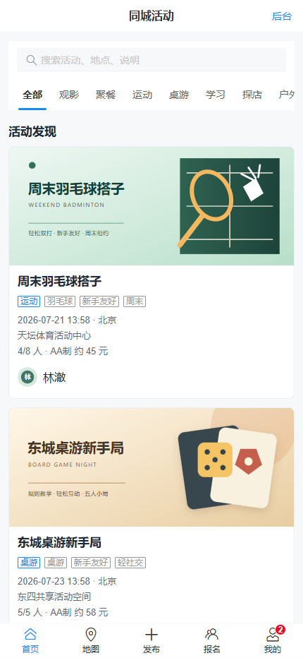
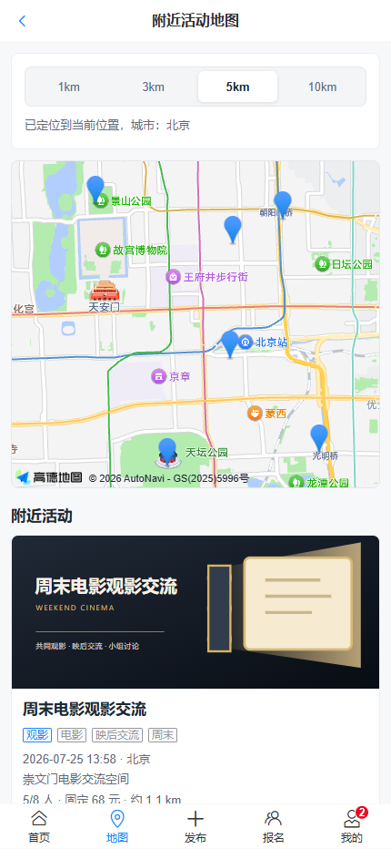
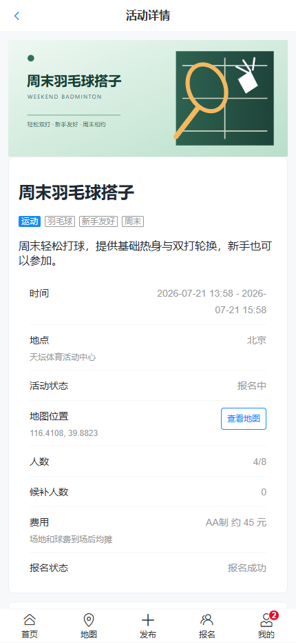
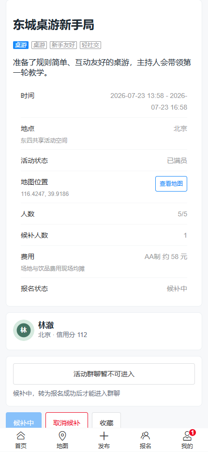
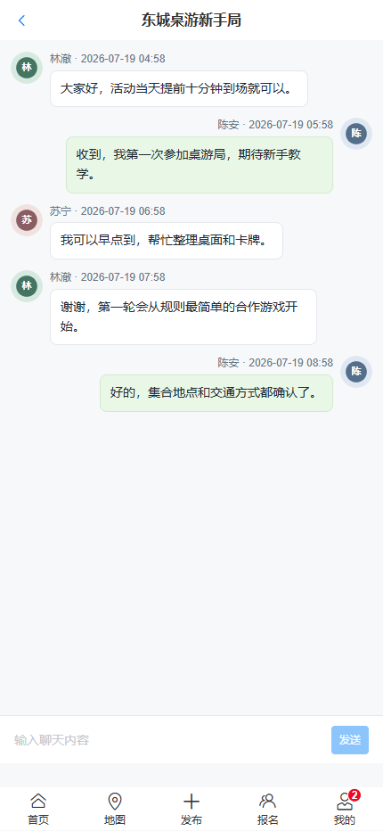
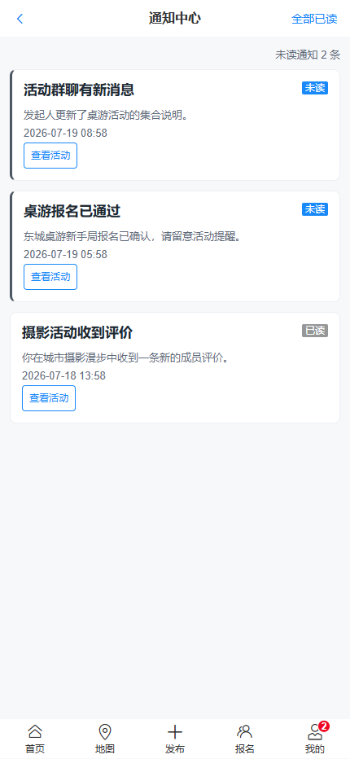
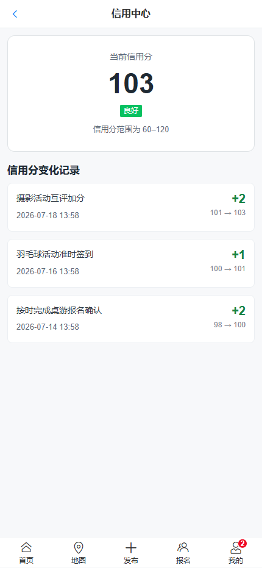
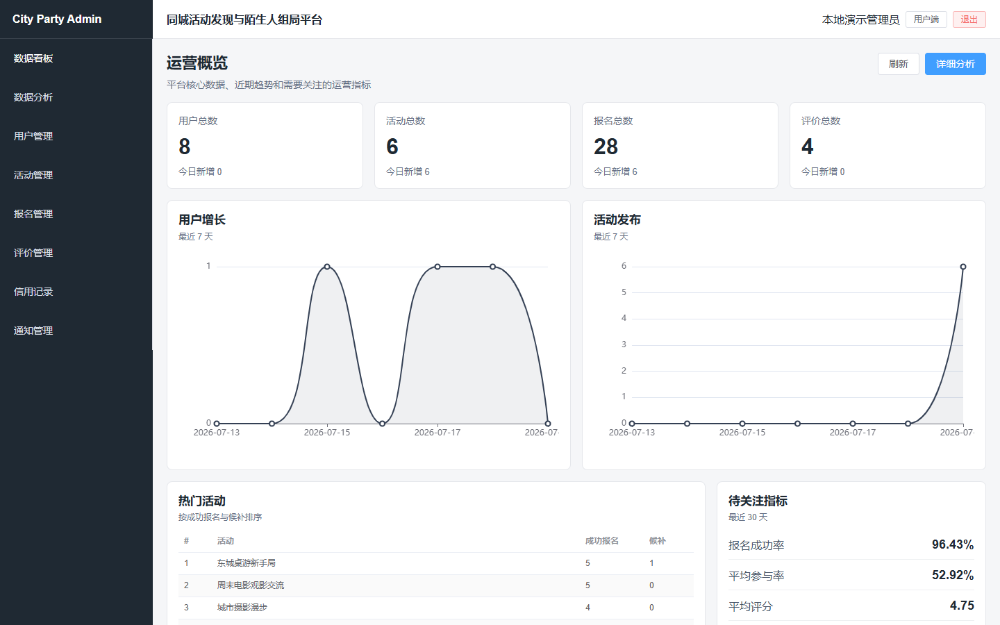
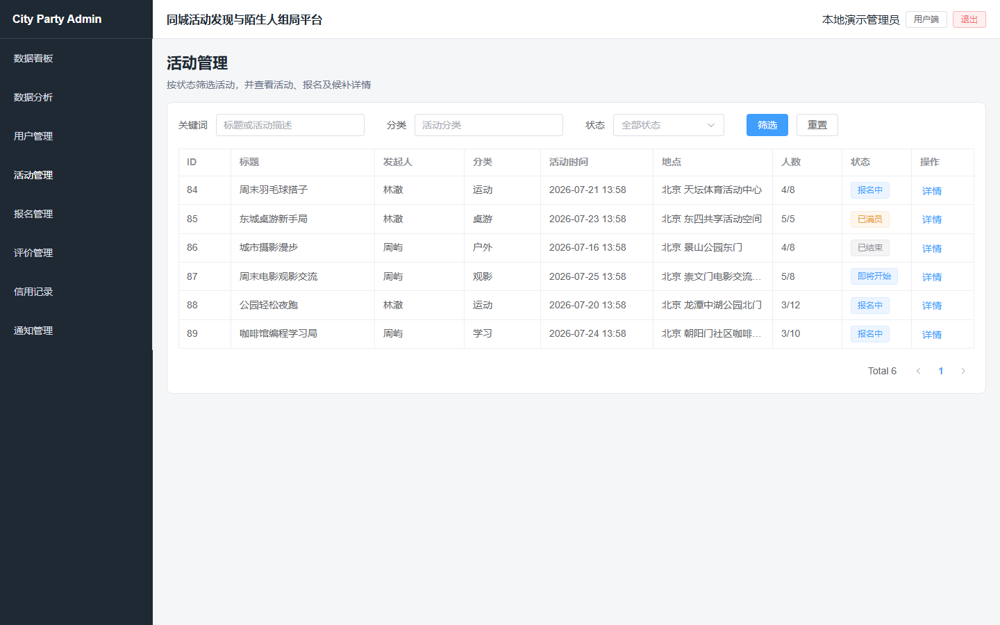
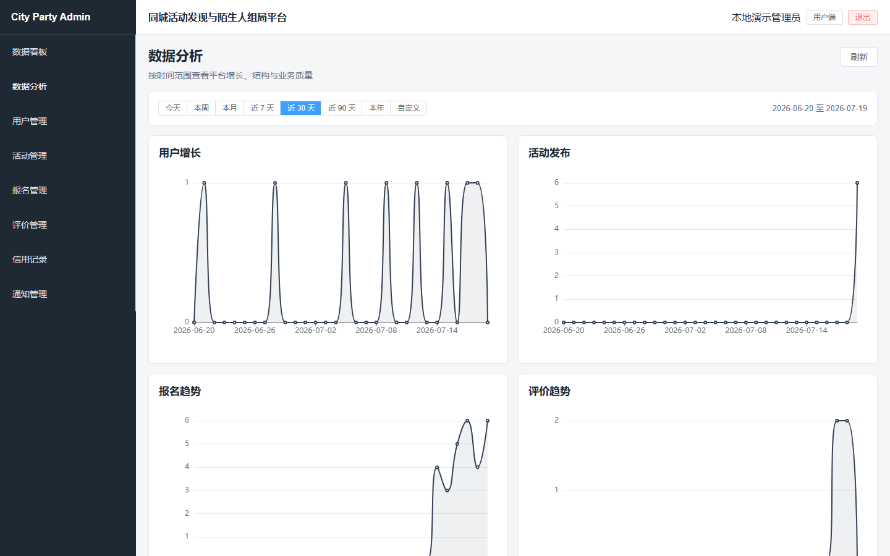

# Vue Portfolio

一个面向 Web 前端实习与初级前端岗位的黑白灰极简个人作品展示站。项目使用 Vue 3、Vite、Vue Router 和 Pinia 构建，重点展示复杂业务前端、全栈实践、工程化交付与静态 Demo。

## 项目特点

- 首页主项目为 CityParty——同城活动发现与陌生人组局平台。
- 使用 10 张已复核的本地运行截图展示移动端 H5、地图、WebSocket 群聊和管理员数据看板。
- CityParty 详情页按用户端与管理后台组织画廊，支持无依赖大图查看和图片加载失败提示。
- 项目数据集中维护，Demo、GitHub 和工程质量区域按字段条件渲染。
- 校园二手交易平台保留完整静态 Demo 和相关交互路由。
- 路由使用 hash 模式，兼容 GitHub Pages 刷新访问。
- 保持黑白灰极简风格，并适配桌面端、平板和移动端。

## 技术栈

- Vue 3
- JavaScript
- Vite
- Vue Router
- Pinia
- 原生 CSS

## 项目列表

1. **同城活动发现与陌生人组局平台**：当前主项目，包含 Vue 3 移动端、Element Plus 管理后台、地图、报名候补、WebSocket 群聊、ECharts 看板及 Spring Boot 后端。项目支持本地完整演示，暂未部署公网业务 Demo。
2. **校园二手交易平台**：早期全栈实践，作品集保留基于 mock 数据的 GitHub Pages 静态 Demo。
3. **LuxeStay 酒店管理系统**：传统 Java Web 管理系统，展示后台业务模块和页面截图。
4. **电影评分数据分析与可视化**：使用 Python 完成数据清洗、统计分析、图表与报告生成。
5. **豆果美食 UI 复刻**：使用 Vue 3、TypeScript、Vite 和 Vant 实现移动端菜谱浏览与交互，并作为独立子项目部署到 GitHub Pages。

CityParty 公开源码：

```text
https://github.com/Cherry-zr/city-party-platform
```

## CityParty 项目截图

以下截图来自 CityParty 本地演示环境，覆盖移动端活动发现、地图、报名候补、群聊与通知，以及管理后台的运营、活动和数据分析页面。

### 移动端用户流程

<table>
  <tr>
    <td align="center"><br><sub>活动发现首页</sub></td>
    <td align="center"><br><sub>附近活动地图</sub></td>
    <td align="center"><br><sub>活动详情与报名</sub></td>
  </tr>
  <tr>
    <td align="center"><br><sub>报名与候补流程</sub></td>
    <td align="center"><br><sub>WebSocket 活动群聊</sub></td>
    <td align="center"><br><sub>活动通知中心</sub></td>
  </tr>
  <tr>
    <td align="center"><br><sub>信用记录</sub></td>
  </tr>
</table>

### 管理后台

#### 管理员运营概览



#### 活动管理



#### 数据分析



## 页面

- 首页：个人定位、核心技术栈、CityParty 主项目预览和五个精选项目
- 关于我：个人简介、教育背景和求职方向
- 技能栈：前端、后端、数据库和工具分类
- 项目展示：全部项目及可用的 Demo、GitHub 入口
- 项目详情：项目介绍、技术栈、功能模块、难点、工程质量和响应式截图画廊
- 静态 Demo：校园二手、酒店管理和电影数据分析展示
- 联系方式：GitHub 与邮箱

## 本地运行

环境建议：

- Node.js 24 或更高版本
- npm 11 或更高版本

在项目根目录执行：

```powershell
Set-Location <your-project-directory>
npm ci
npm run dev
```

默认访问地址：

```text
http://localhost:5173/
```

## 构建与预览

```powershell
npm run build
npm run preview
```

构建产物位于 `dist`。

### 豆果美食子项目

```powershell
Set-Location .\projects\douguo
npm ci
npm run dev
```

本地开发地址为 `http://localhost:5174/home`。生产构建使用 `/vue-portfolio/douguo/` 作为静态资源基础路径，并在 GitHub Pages 中使用 Hash 路由。

## GitHub Pages 部署

部署地址：

```text
https://cherry-zr.github.io/vue-portfolio/#/
```

豆果美食 UI 复刻：

```text
https://cherry-zr.github.io/vue-portfolio/douguo/#/home
```

`vite.config.js` 已配置仓库基础路径：

```js
base: "/vue-portfolio/"
```

仓库使用 `.github/workflows/deploy.yml` 部署：

1. GitHub Pages Source 选择 GitHub Actions。
2. 推送到 `main` 分支后，主站和 `projects/douguo` 分别通过 `npm ci` 安装锁定依赖并构建。
3. 豆果构建产物复制到 `dist/douguo/`，不会覆盖主站入口或其他项目。
4. 工作流只上传一次完整 `dist` 并发布到 GitHub Pages。

## 展示边界

- CityParty 当前提供公开源码、本地完整演示和真实截图，不提供虚假的公网在线 Demo。
- 豆果美食 UI 复刻是非官方学习项目，仅用于前端开发学习和课程展示。
- 豆果项目生产环境读取 `https://apis.netstart.cn/douguo` 的公开 HTTPS 数据；接口、远程图片、CORS 或签名策略可能随上游变化。
- 登录和 AI 营养师仅提供真实能力限制说明，不模拟登录成功、Token、健康数据或 AI 回答。
- 作品集中的工程质量数据均来自项目仓库的历史验收记录，不作为线上生产指标。
- 页面不会公开本机绝对路径、环境变量、密码、Token、地图 Key 或数据库凭据。

## 推荐提交信息

```text
feat: add douguo app to GitHub Pages
```
